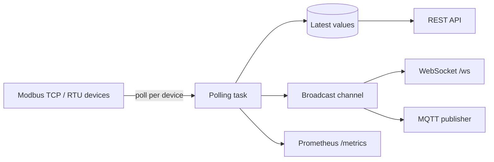

# RustBridge

A Rust gateway that polls Modbus TCP and RTU devices and exposes the register values over REST, WebSocket, MQTT and Prometheus metrics.

[](LICENSE)
[](https://github.com/neurabytelabs/rustbridge/releases)

## Why

PLCs and sensors usually speak Modbus; dashboards, scripts and message brokers usually do not. RustBridge sits in between: you describe devices and registers in one YAML file, it polls them, converts raw registers to typed and scaled values, and serves the latest values to HTTP clients, WebSocket subscribers, an MQTT broker and Prometheus.

There is no live demo.

## Quick start

Requires a Rust toolchain (the Dockerfile builds with Rust 1.91).

```bash
git clone https://github.com/neurabytelabs/rustbridge.git
cd rustbridge
cargo test               # unit + API tests
cargo run --release      # reads ./config.yaml, API on http://localhost:3000
curl http://localhost:3000/health
```

`cargo run` reads `config.yaml` from the working directory; set `RUSTBRIDGE_CONFIG` to use another path. The bundled `config.yaml` expects an MQTT broker on `localhost:1883` and a Modbus device on port 5020. Without them the log shows connection errors, but the API still starts.

Release binaries (Linux x86_64, macOS Intel, macOS Apple Silicon) are on the [releases page](https://github.com/neurabytelabs/rustbridge/releases).

### Docker Compose

```bash
docker compose up -d                          # RustBridge + Mosquitto
docker compose --profile monitoring up -d     # + Prometheus (:9090) and Grafana (:3001)
docker compose --profile dev up -d            # + a Modbus TCP simulator on :5020
```

The compose file mounts `./config.yaml` into the container. Inside the container `localhost` is not the broker, so set `mqtt.host: "mosquitto"` (and device hosts to reachable IP addresses) before starting it. Grafana's default login is set in `.env.example`; change it.

### systemd (bare metal)

```bash
cd deploy
sudo ./install.sh        # builds the release binary if needed, installs the unit
sudo systemctl start rustbridge
sudo journalctl -u rustbridge -f
```

## How it works



Each device in `config.yaml` gets its own polling task. Raw registers are converted to `u16`, `i16`, `u32`, `i32`, `f32` or `bool`, then `scale` and `offset` are applied. The latest value per register is kept in memory for the REST API, and every update is broadcast to WebSocket clients and the MQTT publisher.

Features:

- Modbus TCP and RTU (serial) clients with per-device poll intervals.
- Register types: holding, input, coil, discrete input.
- REST API and a WebSocket stream of register updates.
- MQTT publisher with configurable topic prefix, QoS and retain.
- Prometheus metrics at `/metrics`.
- Optional API key authentication (`X-API-Key` header).

## Configuration

A minimal `config.yaml`:

```yaml
server:
  host: "0.0.0.0"
  port: 3000
  metrics_enabled: true

mqtt:
  enabled: true
  host: "localhost"
  port: 1883
  client_id: "rustbridge"
  topic_prefix: "rustbridge"
  qos: 1
  retain: false

# Optional API key authentication
auth:
  enabled: true
  api_keys:
    - "change-me"
  exclude_paths:
    - "/health"
    - "/metrics"

devices:
  - id: "plc-01"
    name: "Main PLC"
    device_type: tcp
    connection:
      host: "192.168.1.100"   # IP address; hostnames are not resolved
      port: 502
      unit_id: 1
    poll_interval_ms: 1000
    registers:
      - name: "temperature"
        address: 0
        register_type: holding
        count: 1
        data_type: u16
        unit: "°C"
        scale: 0.1

  - id: "sensor-01"
    name: "RTU Sensor"
    device_type: rtu
    connection:
      port: "/dev/ttyUSB0"
      baud_rate: 9600
      data_bits: 8
      stop_bits: 1
      parity: "none"
      unit_id: 1
    poll_interval_ms: 2000
    registers:
      - name: "humidity"
        address: 0
        register_type: input
        count: 1
        data_type: u16
        unit: "%"
```

See [docs/configuration.md](docs/configuration.md) for all options.

## API

| Endpoint | Method | Description |
|----------|--------|-------------|
| `/health` | GET | Health check |
| `/metrics` | GET | Prometheus metrics |
| `/api/info` | GET | API information |
| `/api/devices` | GET | List devices |
| `/api/devices/:id` | GET | Device details |
| `/api/devices/:id/registers` | GET | All register values of a device |
| `/api/devices/:id/registers/:name` | GET / POST | Read a register / write request (see limits) |
| `/ws` | WebSocket | Register updates |

With authentication enabled:

```bash
curl -H "X-API-Key: change-me" http://localhost:3000/api/devices
```

Example register value:

```json
{
  "name": "temperature",
  "value": 72.4,
  "raw": [724],
  "unit": "°C",
  "timestamp": "2025-12-26T23:15:00Z"
}
```

MQTT messages go to `{topic_prefix}/{device_id}/{register_name}`, e.g. `rustbridge/plc-01/temperature`.

Prometheus metrics (all prefixed `rustbridge_`): `register_reads_total`, `errors_total`, `mqtt_publishes_total` (counters); `register_value`, `device_connected`, `active_devices`, `mqtt_connected`, `websocket_connections` (gauges); `read_duration_seconds`, `poll_cycle_seconds` (histograms).

Full reference: [docs/api-reference.md](docs/api-reference.md), [docs/mqtt-integration.md](docs/mqtt-integration.md), [docs/prometheus-metrics.md](docs/prometheus-metrics.md).

## Documentation

| Document | Description |
|----------|-------------|
| [Getting Started](docs/getting-started.md) | Installation and first steps |
| [Configuration](docs/configuration.md) | Configuration reference |
| [API Reference](docs/api-reference.md) | REST API and WebSocket |
| [Modbus Guide](docs/modbus-guide.md) | Modbus background |
| [MQTT Integration](docs/mqtt-integration.md) | Broker setup and topics |
| [Prometheus Metrics](docs/prometheus-metrics.md) | Monitoring |
| [Deployment](docs/deployment.md) | Docker, systemd and other setups |
| [Troubleshooting](docs/troubleshooting.md) | Common issues |
| [Examples](docs/examples.md) | Example configurations |

## Development

```bash
cargo test
RUST_LOG=debug cargo run
cargo clippy
cargo fmt
```

Source layout: `src/config.rs` (YAML config), `src/bridge.rs` (wiring), `src/modbus/` (TCP/RTU client and value conversion), `src/api/` (REST, WebSocket, auth), `src/mqtt/`, `src/metrics/`. Deployment files are in `deploy/`.

## Status / limits

Prototype, version 0.2.0.

- Tested with the unit and API tests in this repo only. It has not been run against real PLCs or serial hardware, and throughput has not been measured.
- `POST /api/devices/:id/registers/:name` validates and acknowledges the request, but the write is not yet forwarded to the Modbus device (see `src/bridge.rs`).
- If a device is unreachable when RustBridge starts, its polling task exits and is not retried; restart the process once the device is up.
- Modbus TCP `host` must be an IP address. A hostname such as `localhost` fails with "Invalid TCP address" (this includes the bundled `config.yaml`; use `127.0.0.1`).
- No MQTT TLS and no rate limiting. API auth is off unless `auth.enabled: true`.
- Release numbering: the `v1.0.0` tag (2025-12-27) is older than `v0.2.0` (2026-01-02). The code at `v1.0.0` has `version = "0.1.0"` in `Cargo.toml`, so that release is really 0.1.0. `Cargo.toml` and [CHANGELOG.md](CHANGELOG.md) hold the real version; the old release is kept so existing download links keep working.

Bug reports: [issues](https://github.com/neurabytelabs/rustbridge/issues).

## License

MIT. See [LICENSE](LICENSE).
